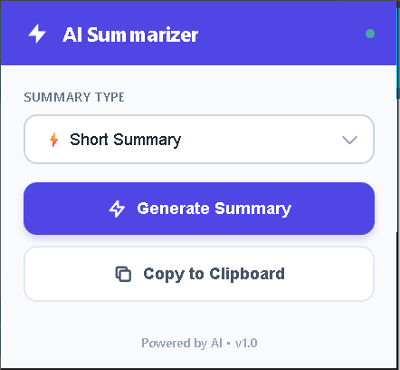
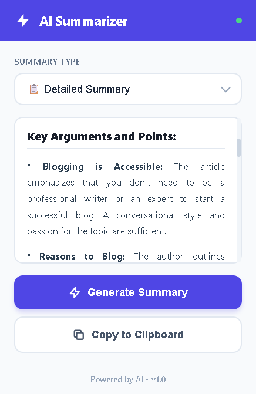

# AI Article Summarizer Chrome Extension 🚀

A powerful Chrome extension that uses Google's Gemini AI to automatically summarize articles and web content. Get instant, intelligent summaries in multiple formats with just one click!


## ✨ Features

- **🤖 AI-Powered Summaries**: Leverages Google Gemini 2.0 Flash for intelligent content summarization
- **📝 Multiple Summary Types**:
  - ⚡ **Brief Summary**: Quick 3-4 sentence overview
  - 📋 **Detailed Summary**: Comprehensive analysis with key details
  - 🔹 **Bullet Points**: Organized list format for easy scanning
- **🎨 Smart Formatting**: Beautiful, readable output with proper headings and structure
- **📋 Rich Text Copy**: Copy summaries with formatting intact (paste into Word, Google Docs, etc.)
- **⚡ Fast & Efficient**: Get summaries in seconds
- **🔒 Secure**: Your API key is stored locally in Chrome's secure storage

## 📸 Screenshots

### Extension Popup


### Summary Example


## 🚀 Installation

### Prerequisites
- Google Chrome browser
- A Gemini API key from [Google AI Studio](https://makersuite.google.com/app/apikey)

### Steps

1. **Clone the repository**
   ```bash
   git clone https://github.com/yourusername/ai-article-summarizer.git
   cd ai-article-summarizer
   ```

2. **Load the extension in Chrome**
   - Open Chrome and navigate to `chrome://extensions/`
   - Enable **Developer mode** (toggle in top-right corner)
   - Click **Load unpacked**
   - Select the extension directory

3. **Set up your API key**
   - Click the extension icon in Chrome toolbar
   - Click the settings/gear icon (or right-click extension → Options)
   - Enter your Gemini API key
   - Click **Save**

## 🎯 Usage

1. **Navigate to any article or webpage** with text content
2. **Click the extension icon** in your Chrome toolbar
3. **Select summary type**:
   - Brief Summary (quick overview)
   - Detailed Summary (comprehensive)
   - Bullet Points (organized list)
4. **Click "Generate Summary"**
5. **Wait a few seconds** for AI to process the content
6. **Copy the summary** with formatting preserved!

### Supported Content
- Blog posts and articles
- News websites
- Documentation pages
- Research papers
- Any webpage with text content wrapped in `<article>` or `<p>` tags

## 📁 Project Structure

```
ai-article-summarizer/
├── manifest.json          # Extension configuration
├── popup.html            # Main popup interface
├── popup.js              # Main logic and API calls
├── formatter.js          # Text formatting utilities
├── content.js            # Content script for extracting text
├── options.html          # Settings page
├── options.js            # Settings page logic
├── style.css             # Styling for popup
├── options.css           # Styling for options page
├── icons/                # Extension icons
│   ├── icon16.png
│   ├── icon48.png
│   └── icon128.png
└── README.md            # This file
```

## 🔧 Configuration

### API Key Setup
The extension requires a Gemini API key to function. You can get one for free:

1. Visit [Google AI Studio](https://makersuite.google.com/app/apikey)
2. Sign in with your Google account
3. Create a new API key
4. Copy and paste it into the extension settings

### Customization

You can customize the summary prompts in `popup.js`:

```javascript
const promptMap = {
    brief: `Your custom brief prompt here`,
    detailed: `Your custom detailed prompt here`,
    bullet: `Your custom bullet point prompt here`
};
```

## 🛠️ Technical Details

### Technologies Used
- **JavaScript (ES6+)**: Core logic
- **Chrome Extension API**: Browser integration
- **Google Gemini 2.0 Flash**: AI model for summarization
- **HTML5 & CSS3**: User interface
- **Chrome Storage API**: Secure key storage
- **Clipboard API**: Rich text copying

### API Integration
The extension uses Google's Gemini AI REST API:
```javascript
POST https://generativelanguage.googleapis.com/v1beta/models/gemini-2.0-flash-exp:generateContent
```

### Key Features Implementation

#### Text Extraction
```javascript
// Extracts text from articles or paragraphs
function getArticleText() {
    let article = document.querySelector('article');
    if (article) return article.innerText;
    
    const paragraphs = Array.from(document.getElementsByTagName('p'));
    return paragraphs.map(p => p.innerText).join('\n\n');
}
```

#### Smart Formatting
- Automatically detects headings, paragraphs, and lists
- Converts markdown-style formatting to HTML
- Preserves structure when copying

#### Rich Text Copying
```javascript
// Copies with both HTML formatting and plain text
const clipboardItem = new ClipboardItem({
    'text/html': new Blob([htmlContent], { type: 'text/html' }),
    'text/plain': new Blob([plainText], { type: 'text/plain' })
});
await navigator.clipboard.write([clipboardItem]);
```

## 🐛 Troubleshooting

### "Failed to fetch article text"
- Make sure you're on a webpage with text content
- Try refreshing the page and clicking the extension again
- Check if the page has `<article>` or `<p>` tags

### "API key not found"
- Go to extension options and enter your Gemini API key
- Make sure you clicked "Save" after entering the key

### "API Error"
- Verify your API key is correct
- Check if you've exceeded the API quota (free tier limits)
- Ensure you have internet connectivity

### Summaries not formatting correctly
- Try switching between different summary types
- Refresh the extension popup and try again

### Copy not working
- Make sure you've allowed clipboard permissions
- Try using a different browser if the issue persists

## 🤝 Contributing

Contributions are welcome! Here's how you can help:

1. **Fork the repository**
2. **Create a feature branch**
   ```bash
   git checkout -b feature/amazing-feature
   ```
3. **Commit your changes**
   ```bash
   git commit -m 'Add some amazing feature'
   ```
4. **Push to the branch**
   ```bash
   git push origin feature/amazing-feature
   ```
5. **Open a Pull Request**

### Development Guidelines
- Follow existing code style
- Test thoroughly before submitting
- Update documentation as needed
- Add comments for complex logic

## 📝 Changelog

### Version 1.0.0 (Initial Release)
- ✅ Basic summarization functionality
- ✅ Three summary types (brief, detailed, bullet)
- ✅ Smart text formatting
- ✅ Rich text copying with formatting
- ✅ Secure API key storage
- ✅ Error handling and user feedback

## 🔮 Future Enhancements

- [ ] Support for more AI models (Claude, GPT-4, etc.)
- [ ] Save summaries history
- [ ] Export summaries to PDF
- [ ] Multiple language support
- [ ] Custom prompt templates
- [ ] Adjustable summary length
- [ ] Keyboard shortcuts

## 📄 License

This project is licensed under the MIT License - see the [LICENSE](LICENSE) file for details.

## 👨‍💻 Author

**Your Name**
- GitHub: [Atharva0745](https://github.com/Atharva0745)
- Email: dhagea0745@gmail.com

## 🙏 Acknowledgments

- Google Gemini AI for the powerful summarization API
- Chrome Extension documentation and community
- All contributors and users of this extension

## 📞 Support

If you encounter any issues or have questions:
- Open an issue on [GitHub Issues](https://github.com/Atharva0745/ai-article-summarizer/issues)
- Review existing issues for solutions

## ⭐ Show Your Support

If you find this extension helpful, please consider:
- Giving it a ⭐ on GitHub
- Sharing it with others
- Contributing to the project
- Reporting bugs and suggesting features

---

**Made with ❤️ by Atharva, for developers**
